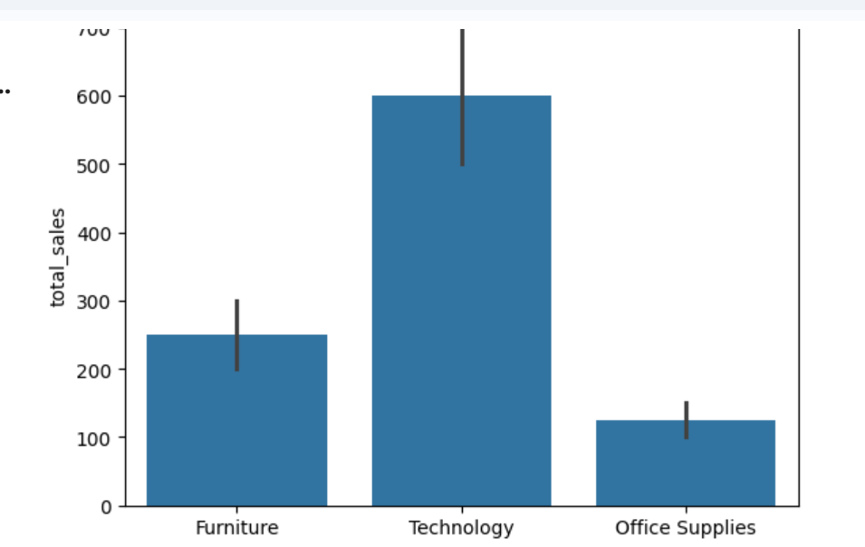

# 🛒 E-Commerce Sales Analysis using Python

## 📌 Project Overview
This project focuses on analyzing e-commerce sales data to uncover meaningful business insights. The analysis includes data cleaning, visualization, and identifying trends that can help improve business decision-making.

---

## 🎯 Objective
- To analyze sales performance
- To identify top-performing categories and regions
- To understand profit trends and the impact of discounts

---

## 🛠️ Tools & Technologies Used
- Python
- Pandas (Data Cleaning & Analysis)
- Matplotlib (Visualization)
- Seaborn (Visualization)

---

## 🧹 Data Cleaning
- Removed missing values using dropna()
- Removed duplicate records using drop_duplicates()
- Ensured clean and structured dataset for accurate analysis
- The dataset used in thi project was manually created to simulate real-world e-commerce sales data.
---

## 📊 Exploratory Data Analysis (EDA)
- Sales by Category
- Profit by Region
- Discount vs Profit analysis
- Trend analysis using visualizations

---

## 🔍 Key Insights
- Some categories generate higher sales compared to others
- High discounts negatively impact overall profit
- Certain regions perform better in terms of revenue and profitability

---

## 📈 Conclusion
The analysis helps businesses focus on profitable categories and optimize discount strategies to improve overall performance.

---

## 🚀 Project Highlights
- End-to-end data analysis project
- Real-world business insights
- Clean and structured code
- Beginner to intermediate level project

---

## 📂 Files Included
- ecommerce_sales_analysis.ipynb
- Custom created dataset (CSV)
- README.md

---
## 📊 Project Output
- 
---
## 🙋‍♀️ Author
Tanuja
